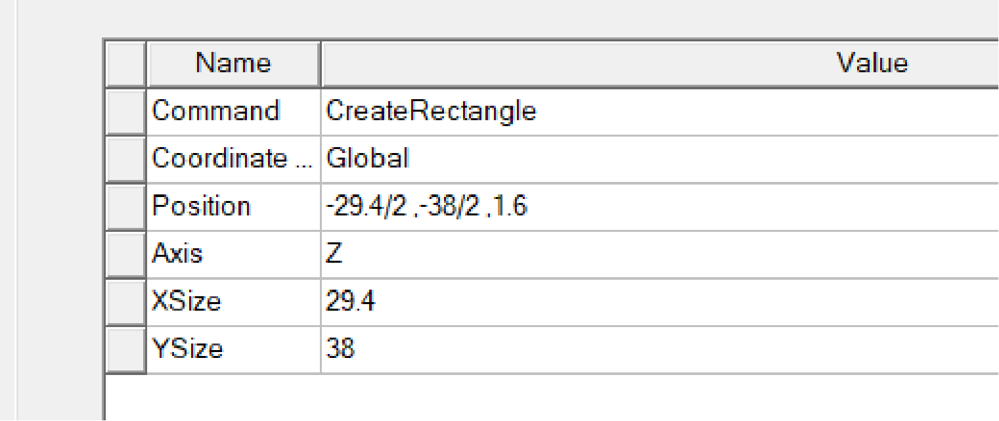
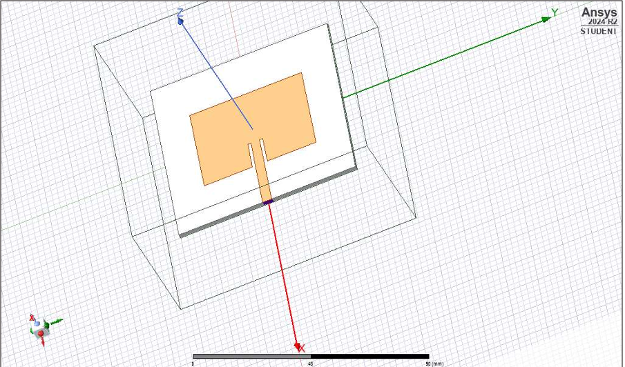
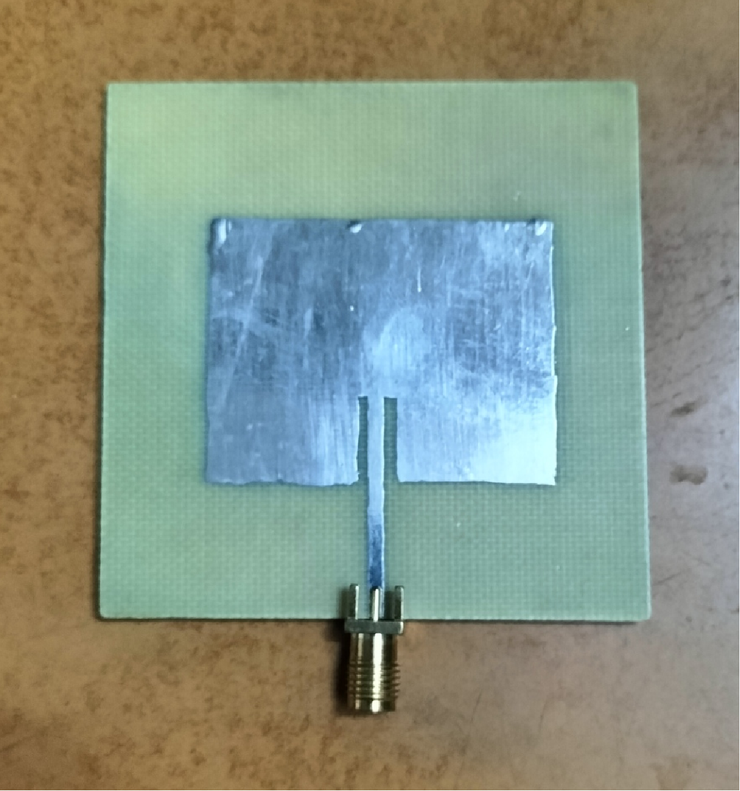
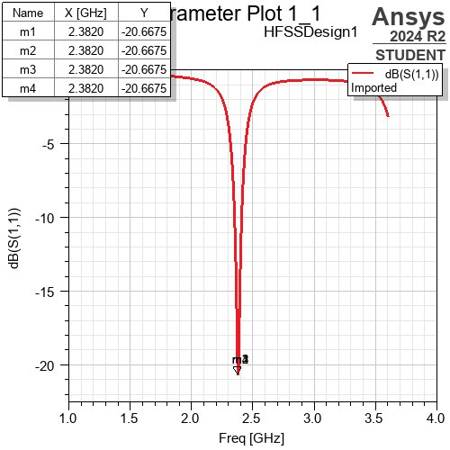
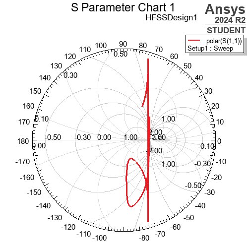
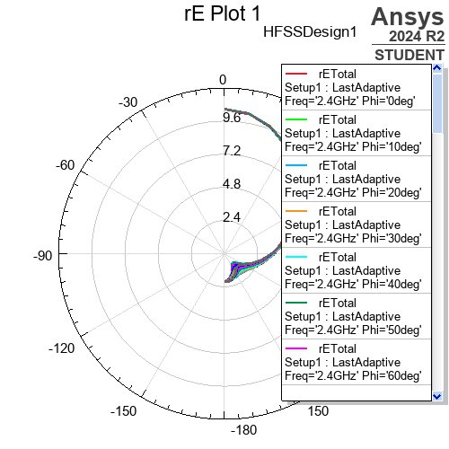

# Microstrip Patch Antenna Design and Simulation

## Project Overview

This project presents the **design and electromagnetic simulation of a rectangular microstrip patch antenna** using **ANSYS HFSS 2024**.

The antenna was designed for the **2.4 GHz frequency range** using an **FR4 dielectric substrate**. The final simulation produced a resonant frequency of approximately **2.382 GHz**, with a return loss of **-20.6675 dB** and a VSWR of **1.20**.

The project covers antenna dimension calculations, HFSS modeling, S-parameter analysis, impedance matching using a Smith chart, and radiation-pattern analysis.

---

## Objectives

* Design a rectangular microstrip patch antenna for the 2.4 GHz frequency range.
* Calculate the required patch dimensions using standard design equations.
* Model the antenna structure in ANSYS HFSS 2024.
* Analyze S-parameters and return loss.
* Evaluate impedance matching using a Smith chart.
* Analyze VSWR and radiation characteristics.
* Compare theoretical calculations with simulation results.

---

## Tools and Technologies

* **ANSYS HFSS 2024**
* Electromagnetic simulation
* Microstrip antenna design
* S-parameter analysis
* Smith chart analysis
* Radiation-pattern analysis

---

## Antenna Specifications

| Parameter                        |       Value |
| -------------------------------- | ----------: |
| Target frequency                 |     2.4 GHz |
| Simulated resonant frequency     |   2.382 GHz |
| Substrate                        |         FR4 |
| Dielectric constant (εᵣ)         |         4.4 |
| Substrate thickness              |      1.6 mm |
| Patch width                      |    38.02 mm |
| Effective dielectric constant    |       ≈ 4.0 |
| Effective length                 |    31.37 mm |
| Fringing length extension        |   ≈ 0.75 mm |
| Final calculated physical length |  ≈ 29.87 mm |
| Return loss (S11)                | -20.6675 dB |
| VSWR                             |        1.20 |

The project report also specifies the modeled patch dimensions as approximately **29.7 mm × 38 mm**.

---

## Antenna Design

### Design Approach

<p align="center">
  
</p>

### HFSS 3D Model

<p align="center">
  
</p>

---

## Antenna Structure

The HFSS model consists of the following main elements:

* **Radiating Patch** – rectangular copper patch responsible for electromagnetic radiation.
* **Feedline** – used to excite the patch.
* **Ground Plane** – conductive layer below the substrate.
* **FR4 Substrate** – dielectric material with a relative permittivity of 4.4.
* **Radiation Box** – simulation region representing the surrounding open space.

<p align="center">
  
</p>

---

## Design Methodology

### 1. Frequency Selection

The antenna was designed for operation around **2.4 GHz**. HFSS simulation produced a resonant frequency of approximately **2.382 GHz**.

### 2. Substrate Selection

An **FR4 substrate** was selected with:

* Dielectric constant: **εᵣ = 4.4**
* Substrate thickness: **1.6 mm**

### 3. Antenna Dimension Calculation

Standard microstrip patch antenna design equations were used to determine the required dimensions.

The calculated effective dielectric constant was approximately **4.0**.

The effective patch length was calculated as **31.37 mm**. After accounting for the fringing-field effect, the final calculated physical length was approximately **29.87 mm**.

### 4. HFSS Modeling and Simulation

The antenna structure was modeled in **ANSYS HFSS 2024** using the calculated dimensions and material properties.

The model was simulated over the selected frequency range to evaluate return loss, impedance matching, VSWR, and radiation characteristics.

---

## Simulation Results

### Return Loss (S11)

The simulated S-parameter response shows resonance at approximately **2.382 GHz**.

The minimum return loss obtained was:

**S11 = -20.6675 dB**



---

### VSWR

The simulated VSWR was:

**VSWR = 1.20**

This indicates good matching between the antenna and the transmission line around the resonant frequency.

---

### Smith Chart

The Smith chart was used to analyze the input impedance and matching characteristics of the antenna across the simulated frequency range.

The impedance trajectory approaching the center of the Smith chart indicates matching toward the **50-ohm reference impedance**.



---

### Radiation Pattern

The radiation pattern represents the variation of the radiated electric-field strength with direction at approximately **2.4 GHz**.

It provides a visual representation of the antenna's directional radiation characteristics.



---

## Key Results

| Parameter           |          Result |
| ------------------- | --------------: |
| Resonant frequency  |   **2.382 GHz** |
| Return loss         | **-20.6675 dB** |
| VSWR                |        **1.20** |
| Substrate           |         **FR4** |
| Dielectric constant |         **4.4** |
| Substrate thickness |      **1.6 mm** |

---

## Applications

Microstrip patch antennas are commonly used in wireless and RF communication systems. Potential applications include:

* Wireless LAN (Wi-Fi)
* Bluetooth systems
* Satellite communication
* Radar systems
* Wireless communication devices

---

## Repository Structure

```text
Antenna-Design-and-Simulation/
│
├── README.md
│
├── diagrams/
│   ├── antenna-structure.png
│   ├── antenna-design-approach.png
│   └── hfss-3d-antenna-model.png
│
└── results/
    ├── return-loss-s11.png
    ├── smith-chart.png
    └── radiation-pattern.png
```

---

## Project Team

**Apurva Bagadi**
**Anushka Goswami**
**Nisha Bagal**

**Guide:** Prof. Dr. Shital Pawar

**Vishwakarma Institute of Technology, Pune**

---

## Conclusion

A rectangular microstrip patch antenna was designed and simulated using **ANSYS HFSS 2024** with an FR4 substrate.

The simulation achieved a resonant frequency of **2.382 GHz**, a return loss of **-20.6675 dB**, and a VSWR of **1.20**.

The results demonstrate good impedance matching and resonant behavior, highlighting the use of HFSS for electromagnetic analysis and performance evaluation of microstrip patch antennas.
